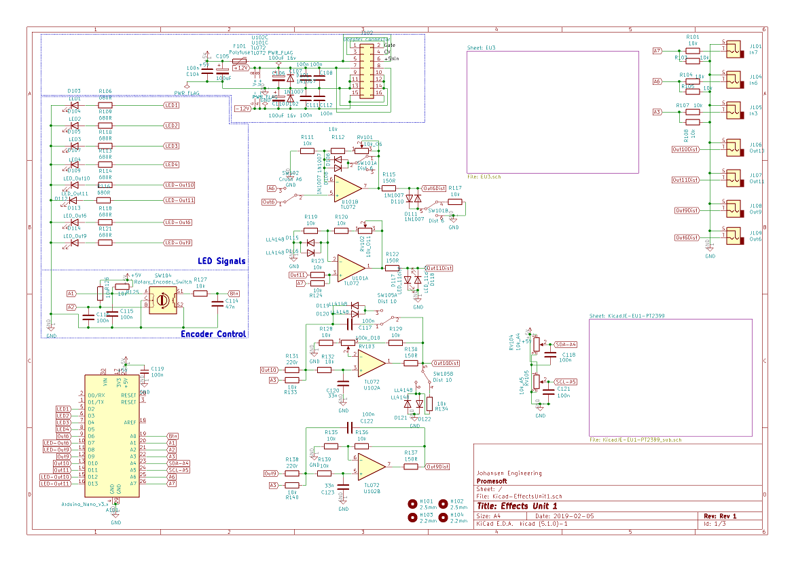
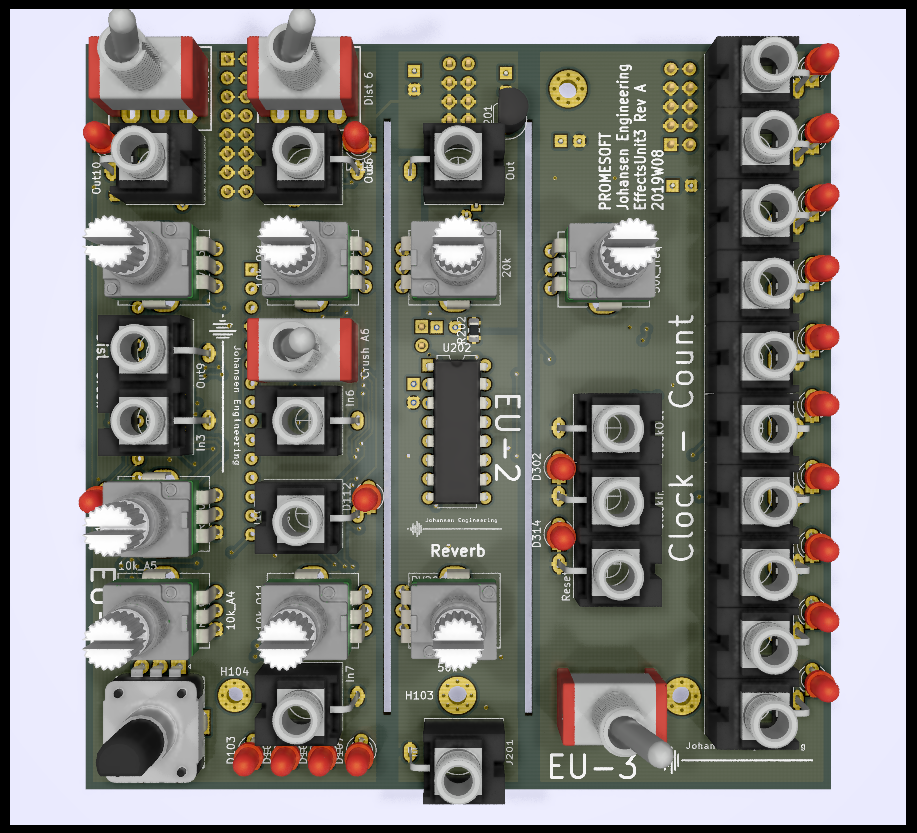

# KicadJE_EffectsUnit1
JE-EU1 - PT2399 based reverb - distortion units
Eurorack form factor

# MK1 Design
## Status - operational
# Status - Secondary tests
## Initial 
| Stage  | Detail | Status |
| ------------- | ------------- | ------------- |
| create material  | sch/pcb | produced Rev A  |
| | gerber | Produced |
| production  | ordered  | YES |
|  | produced | YES |
|  | delivered | YES |
## Preliminary validation
| Test  | Detail | Status |
| ------------- | ------------- | ------------- |
| Initial Inspection |  | OK |
| Initial Technical Test | PT2399 | OK - See Errata |
| Initial Technical Test | Counter  | OK |
| Initial Technical Test | Bitcrunch |  |
| Initial Product Test | PT2399 | OK |
| Initial Product Test | Counter | OK |
| Initial Product Test | Bitcrunch  | OK - LFO w Distortion |
| Initial Power Consumption | PT2399 | 40-60mA ! +12v depending on VCO circuit |
| Initial Power Consumption | Counter | 20mA +12v  |
| Initial Power Consumption | Bitcrunch | +12v +5v -12v |

## Secondary validation
| Test  | Detail | Status |
| ------------- | ------------- |------------- |
| Product Test | PT2399 | ok after mod |
| Product Test | Counter | OK |
| Product Test | LFO Distortion | OK - dist too much |
| Product Test | Bitcrush Distortion |  |
| Quality | LFO | good - distortion is questionable effect |
| Quality | Bitcrush |  |
| Quality | Counter | Good - needs input prot |
| Quality | PT2399 | ongoing |
| Long Term Product Test | PT2399 | Modded version installed in rack |
| Long Term Product Test | Counter |  |
| Long Term Product Test | Bitcrush |  |
| Long Term Product Test | LFO |  |

## Software 
| Test  | Detail | Status |
| ------------- | ------------- |------------- |
| Initial SW | copy from MK1 and adjusted | OK! |
| Bitcrush | UI | |
| Bitcrush | Crush function | |
| LFO Control | UI | Individual speed and waveform impl |
| LFO Control | Function | Individual LFO implemented |
| LFO Control | Input | 3x Trigger done |

## Errata
### ERRATA - PT2399
 * 78L05 inv pinout
 * MMBT2222 wrong pinout - workaround flip and turn
 * Delay time pot reversed
 * PT2399 occational latchup with modification
### ERRATA - Counter
### ERRATA - Bitcrunch
 * SW 101 and SW105 should change footprint (too small for MT202)
 * D110 and D111 is 0805 and cannot be fitted with SOD123
## Issues and Notes
### Issues and Notes - PT2399
 * Replace 20k across Q203 w Yellow LED
 * Replace 120k R214 with 47k
 * Move C222 across RV202 - move D2015 across R214 and remove Q202+R213
 * Consider Vactrol of RV202 and RV201
 * Consider +5V supply...
### Issues and Notes - Counter
 * Replace 100uF C310 with 10-22uF (consider a switch for next rev)
 * Reset/Clk in Trigger not 5V tolerant
 * Add I/O protection

### Issues and Notes - Bit Crunch
LFO only values:
 * 11k = 10k
 * 22k = 10k
 * 33k = 10k
 * 44k = 10k
 * 11n = 100n
 * 22n = 100n
 * 33n = 100n
 * 44n = 100n
 * D118 - D117 remove
 * Optional D111 - D110
Dist/Bitcrush values has been added to the sch
 * Move LED D114 closer to Out9

### Workarounds

## Base Construction 
The idea is to have 3 different units.
Practically it may be required to fit the bitcrusher and the distortion in one unit.
### Distortion base board with Arduino Bitcrusher
 - 16pin Europower connector
 
 

### PT2399 base board 
 - 10pin Europower connector
 - BC547 or BC337 NPN and Zener 7v5 regulator followed by 78L05 regulator
 - PT2399 echo circuit with anti lockup circuit for pin 6
 - 
### Binary counter and clock
 - 10pin Europower connector
 - Build around a CD4017 counter chip (SOP-14)
 
 
 

## Vital Components
 - Arduino Nano
 - PT2399
 - CD4017
 - NE555
 - Mini Jacks (PJ-321) 
 - ALPS RV09 potentiometer
 - TL072 or similar dual op amp
 - Diode clipping (silicium signal diodes, LED, power, shottkey, germanium
 
### Mechanical

The construction is inspired from
-----------------------------------------------------
 - https://www.electronics-tutorials.ws/waveforms/555_oscillator.html (Counter clock)
 - https://www.electrosmash.com/pt2399-analysis (PT2399 Reverb)
 - http://sim.okawa-denshi.jp/en/OPttool.php (Filter calc for MFB filter)
 - http://sim.okawa-denshi.jp/en/OPseikiLowkeisan.htm (Filter calc for Sallen Key filter (Out9 and Out10))
