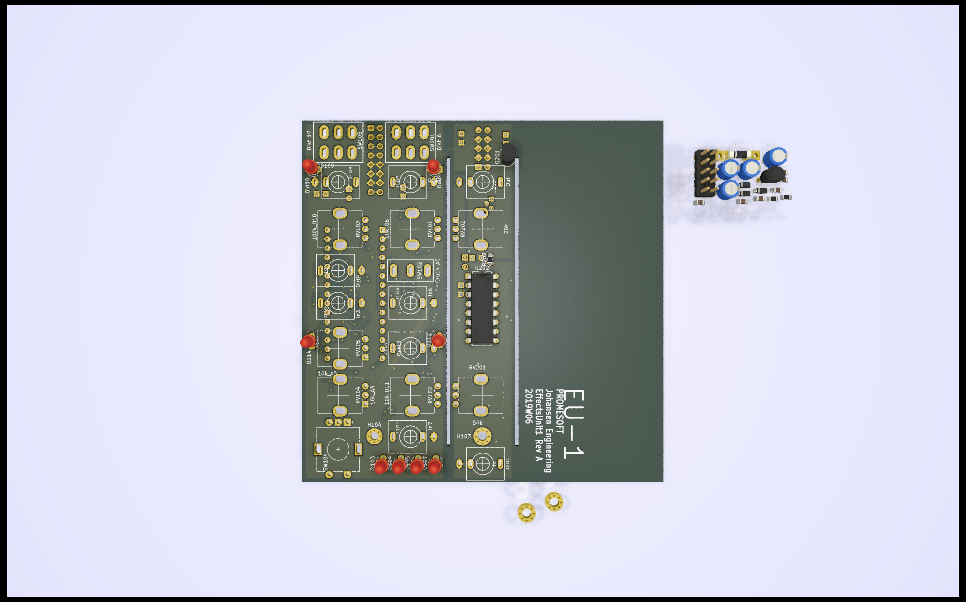

# KicadJE_EffectsUnit1
JE-EU1 - PT2399 based reverb - distortion units
Eurorack form factor

# MK1 Design
## Status - Project initialisation
### Issues and Notes
 * Note
### Errata
### Workarounds

## Base Construction 
The idea is to have 3 different units.
Practically it may be required to fit the bitcrusher and the distortion in one unit.
### Distortion base board with Arduino Bitcrusher
 - 16pin Europower connector
### PT2399 base board 
 - 10pin Europower connector
### Binary counter and clock
 - 16pin Europower connector
 
 
 

## Vital Components
 - Arduino Nano
 - PT2399
 - Mini Jacks (PJ-301)
 - Mini Jacks (PJ-321) 
 - ALPS RV09 potentiometer
 - TL072 or similar dual op amp
 - Diode clipping (silicium signal diodes, LED, power, shottkey, germanium
 
### Mechanical

The construction is 
-----------------------------------------------------
